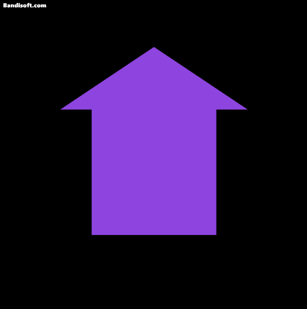
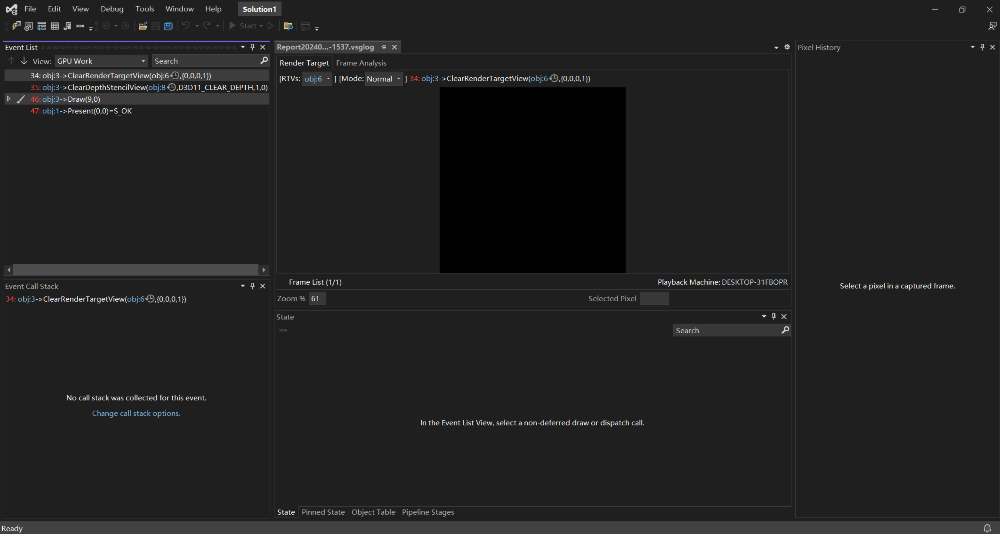
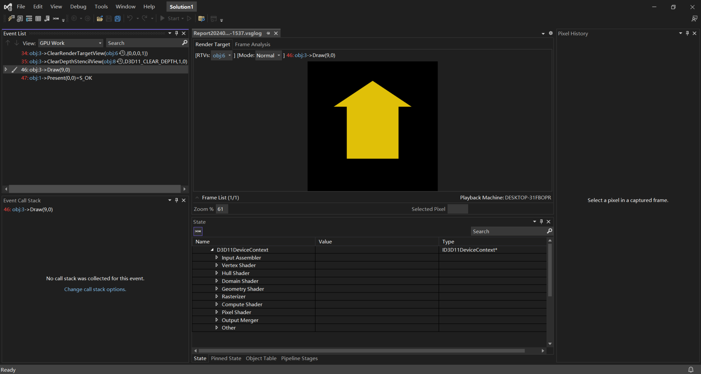
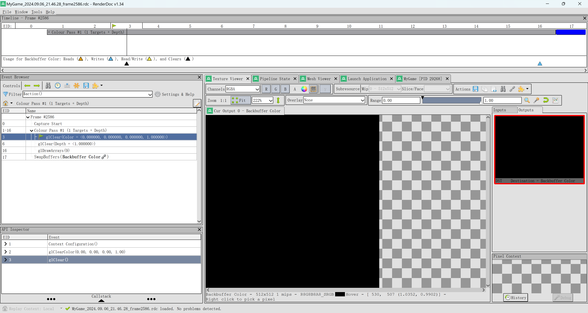
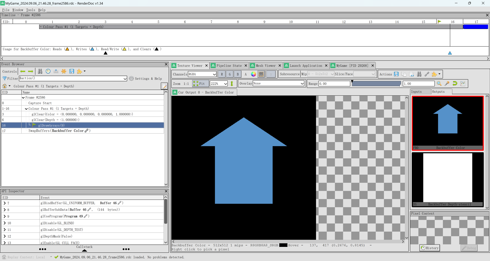
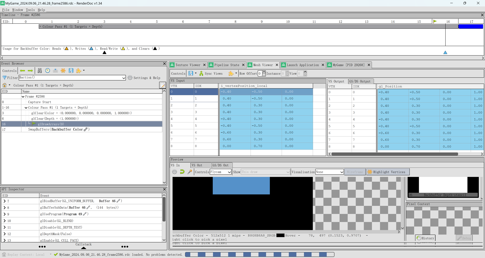

+++
author = "Yan Liu"
title = "Game Engine II Assignment02"
date = "2024-09-06"
description = "The details of assignment 02 for eae6320."
tags = [
    "EAE6320"
]
categories = [
    "game engine"
]
series = ["Themes Guide"]
aliases = ["migrate-from-jekyl"]
image = "engine.jpg"

+++

## Gif of My Game

## GPU Capture

### Direct3D

### OpenGL

## Interface Code

~~~c++
//declare variables
namespace{
	// Geometry Data
	//--------------
	eae6320::Graphics::Mesh mesh;

	// Shading Data
	//-------------
	eae6320::Graphics::Effect effect;
}

//In RenderFrame function
{
	// Bind the shading data
	effect.BindShadingData();

	// Draw the geometry
	mesh.Draw();
}

//In Initialize function
{
    // Initialize the shading data
    {
        if ( !( result = effect.InitializeShadingData() ) )
        {
            EAE6320_ASSERTF( false, "Can't initialize Graphics without the shading data" );
            return result;
        }
    }
    // Initialize the geometry
    {
        if ( !( result = mesh.InitializeGeometry() ) )
        {
            EAE6320_ASSERTF( false, "Can't initialize Graphics without the geometry data" );
            return result;
        }
    }
}

//In CleanUp function
{
    result = mesh.CleanUp();

	result = effect.CleanUp();
}
~~~

## Platform Difference

In Graphics.d3d.cpp, there are variables and functions work for "views". Considering that these codes only exist in the d3d file, a view class can be created to handle the relevant logic, and macros (EAE6320_PLATFORM_D3D) can be used in Graphics.cpp to support this part.

~~~c++
//Graphics.d3d.cpp
// In Direct3D "views" are objects that allow a texture to be used a particular way:
// A render target view allows a texture to have color rendered to it
ID3D11RenderTargetView* s_renderTargetView = nullptr;
// A depth/stencil view allows a texture to have depth rendered to it
ID3D11DepthStencilView* s_depthStencilView = nullptr;
~~~

In Graphics.d3d.cpp, direct3dImmediateContext is used to clear image buffer and depth buffer, while the functions provided by OpenGL are used to do the same job in Graphics.gl.cpp. Considering do the similar job like mesh class of this assignment to make Graphics.cpp can be platform-independent.

## Game Sample

Download and have a try: [MyGame](https://drive.google.com/uc?export=download&id=1zW9ilS0uB5OgJhBIoBi25OtCTbqjBXA3)
