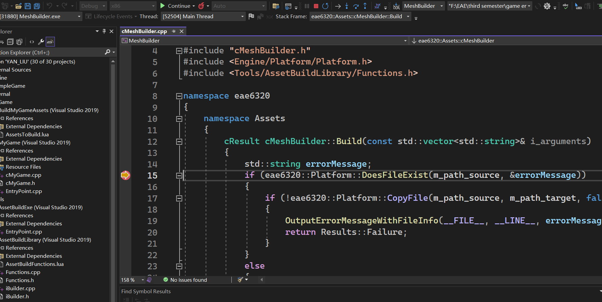

+++
author = "Yan Liu"
title = "Game Engine II Assignment06"
date = "2024-10-04"
description = "The details of assignment 06 for eae6320."
tags = [
    "EAE6320"
]
categories = [
    "game engine"
]
series = ["Themes Guide"]
aliases = ["migrate-from-jekyl"]
image = "engine.jpg"

+++

## Gif of My Game

## Advantages of Human-readable Asset Files

- Creators can easily make formatting changes in the later stages;
- Readers can quickly understand the file structure and what each section represents;
- People who need to use this type of file can easily write code to retrieve its contents;

## Mesh Files

Here is an example of my lua structure

~~~lua
return
{
vertex = 
{
{ -0.4, -0.4, 0.0 },
{  0.4, -0.4, 0.0 },
{  0.4,  0.4, 0.0 },
{ -0.4,  0.4, 0.0 },
},
index  = 
{
	0, 1, 2,
    0, 2, 3,
},
}
~~~

The reason I do it in this way is that it is a highly readable structure. By using keywords like "vertex", the reader would quickly understand the usage of each block.

## Screenshot of Debugging

## Game Sample

Download and have a try: [MyGame](https://drive.google.com/uc?export=download&id=1BmnYGLnEa65Duiq5Xi7b1fhZzl05btvE)
