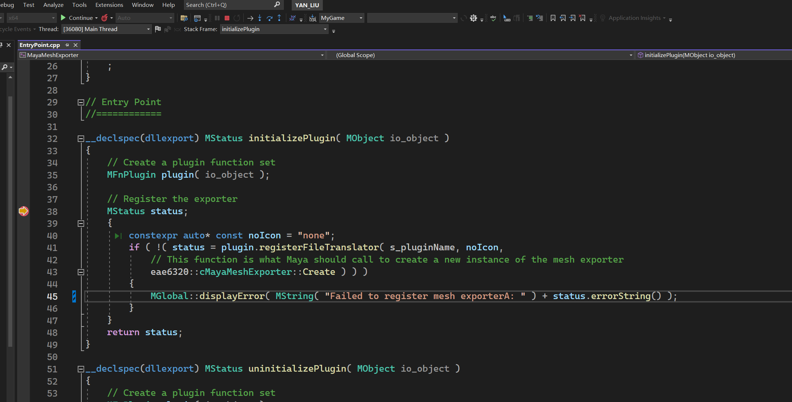

+++
author = "Yan Liu"
title = "Game Engine II Assignment07"
date = "2024-10-18"
description = "The details of assignment 07 for eae6320."
tags = [
    "EAE6320"
]
categories = [
    "game engine"
]
series = ["Themes Guide"]
aliases = ["migrate-from-jekyl"]
image = "engine.jpg"

+++

## Gif of My Game

## References to MayaMeshExporter

There is no reference is needed for MayaMeshExporter to successfully build

## Projects depend on MayaMeshExporter

There is no project depends on MayaMeshExporter

## Maya Plug-in

I didn't export the unused data. Considering that if there is a real demand for these unused data in the future, a lot of work needs to be done to support them. It may be more convenient to add the data at that time, and it will be clearer to know what data I need and what format I want it to be in.

## Model with too Many Vertices

It would crash if a mesh with too many vertices is rendered. Because the current logic of the engine is to have the GPU process all the vertices of a model at once, which may cause communication and rendering bottlenecks between the CPU and GPU, leading to crashes. This problem can be solved through methods such as batch uploading in the future

## Screenshot of Debugging

## Game Sample

Download and have a try: [MyGame](https://drive.google.com/uc?export=download&id=1evNVwc1mQD2fLJ_7TWS-XjNCb3HqDQeV)
