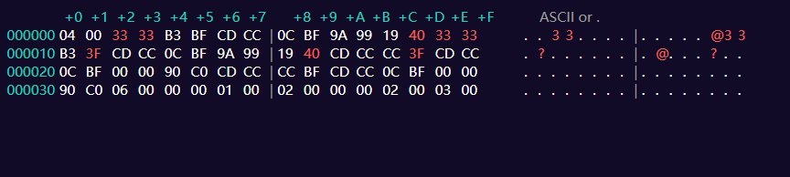
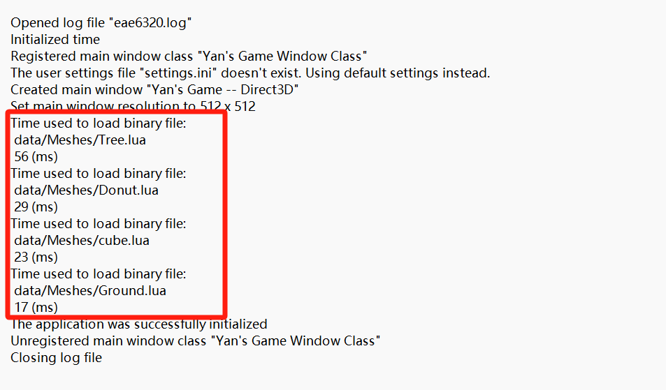
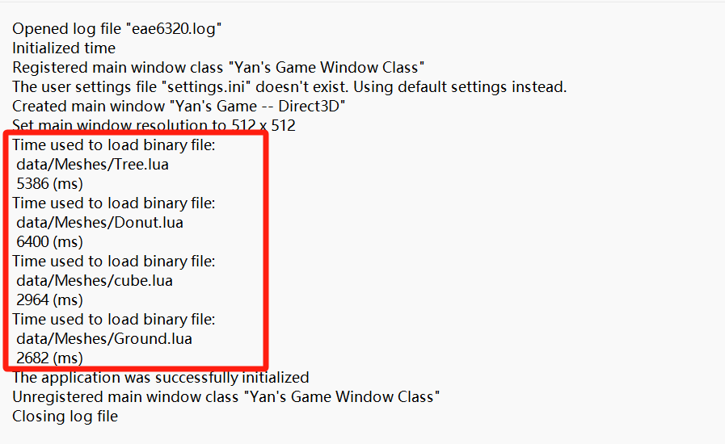
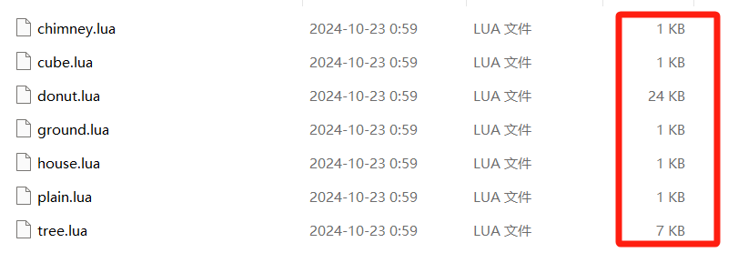
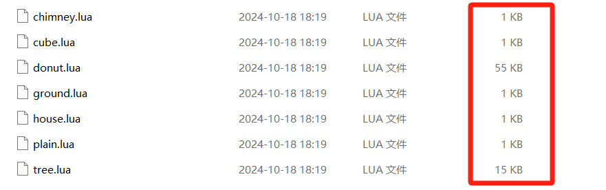

+++
author = "Yan Liu"
title = "Game Engine II Assignment08"
date = "2024-10-25"
description = "The details of assignment 08 for eae6320."
tags = [
    "EAE6320"
]
categories = [
    "game engine"
]
series = ["Themes Guide"]
aliases = ["migrate-from-jekyl"]
image = "engine.jpg"

+++

## Gif of My Game

## Binary Geometry File

### Contents

The contents stored in a binary file are, in order, **the number of vertex**, **vertex data**, **the number of index**, **index data**.

**04 00** **33 33 B3 BF CD CC 0C BF 9A 99 19 40 33 33**

**B3 BF CD CC 0C BF 9A 99 19 40 CD CC CC 3F CD CC**

**0C BF 00 00 90 C0 CD CC CC BF CD CC 0C BF 00 00**

**90 C0** **06 00** **00 00 01 00 02 00 00 00 02 00 03 00**

### Advantages

>  **Advantages of Binary Formats:**

- **Efficient Storage and Transmission**: Binary formats typically take up less space than human-readable formats because they store raw data directly rather than using characters.
- **Reduced Data Redundancy**: Binary formats avoid much of the redundancy present in human-readable formats (like tags, whitespace), improving efficiency further.
- **Faster Processing**: Since binary formats are more compact, computers can parse and process them more quickly, which is crucial for performance-sensitive applications.

> **Advantages of Human-Readable Format:**

- **Readability and Easier Debugging**: Human-readable formats are easy to understand, allowing developers to directly view and edit data when debugging and maintaining code.
- **Ease of Modification**: Developers and users can easily modify these files manually, which is useful in development, configuration, and testing environments for quick edits.

> **The benefit of using binary formats at run-time but human-readable formats to store the data in source control:**

The higher the runtime efficiency, the better, so using binary files has obvious advantages. However, in source control, the higher the readability, the better. Therefore, using human readable files is more advantageous. By compiling human readable files into binary files before running, the advantages of both file formats are fully utilized.

### Platform Support

By checking the binary files generated for Direct3D and OpenGL platforms, I found the built binary geometry files are the same. The reason is also very simple, because the reading of binary files is platform independent and has nothing to do with which platform it runs on.

### Extract Data

~~~c++
uint16_t vertexCount = *reinterpret_cast<uint16_t*>(buffer);
currentOffset += sizeof(vertexCount);
Graphics::VertexFormats::sVertex_mesh* vertexData = reinterpret_cast<Graphics::VertexFormats::sVertex_mesh*>(currentOffset);
currentOffset += sizeof(Graphics::VertexFormats::sVertex_mesh) * vertexCount;
uint16_t indexCount = *reinterpret_cast<uint16_t*>(currentOffset);
currentOffset += sizeof(indexCount);
uint16_t* indexData = reinterpret_cast<uint16_t*>(currentOffset);
~~~

### Compare

The binary format has significant advantages in storage space and running efficiency compared to the previous Lua format

| Speed of loading binary file                                 | Speed of loading Lua file                                    |
| ------------------------------------------------------------ | ------------------------------------------------------------ |
|  |  |

| Size of binary file                                          | Size of Lua file                                             |
| ------------------------------------------------------------ | ------------------------------------------------------------ |
|  |  |

## Game Sample

Download and have a try: [MyGame](https://drive.google.com/uc?export=download&id=13esLG-73gmxpHtcaUi253et8ZbagmQAN)
