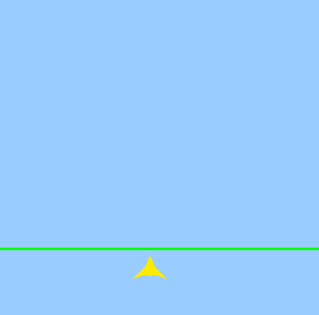
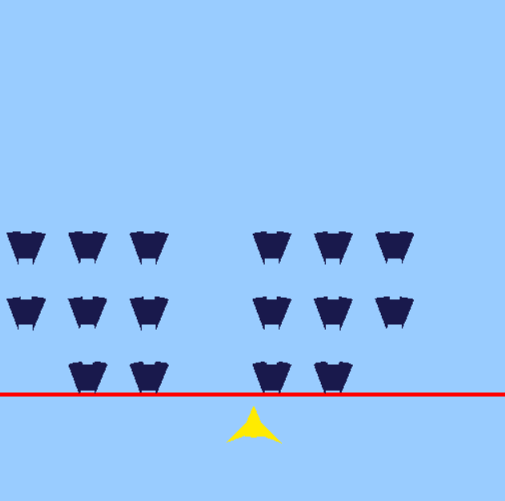

+++
author = "Yan Liu"
title = "Game Engine II Final Project"
date = "2024-12-01"
description = "My final project!"
tags = [
    "EAE6320"
]
categories = [
    "game engine"
]
series = ["Themes Guide"]
aliases = ["migrate-from-jekyl"]
image = "engine.jpg"

+++

## Gif of My Game

## About My Game

### Why I Choose It

- Space Invader which I chose as the reference is a very classic arcade game;
- This game is easy to show how my collision system and the audio system I chose work in the game;
- This game is not very hard to make but is interesting meanwhile;
- The first game I made in my life (16 age) was also a game like Space Invader, so I really want to make another one as the first game of my game engine :) , which is very meaningful I think;

### How to Play It

> **Operation**

"**A**" and "**D**" to move left or right;

"**Space**" to shoot the enemy;

> **Win Condition**

Destroy all the enemies before they reach the **black** line.

If you made it, you would hear a sound representing you win and the **black** line would turn to **green**.

> **Loss Condition**

Did not destroy all the enemies before they reach the **black** line.

If you fail, you would hear a sound representing you lose and the **black** line would turn to **red**.

## My Experience of Making the Game

> **How did it fit into my existing engine**

While making this game, I utilized my collision system for the following tasks:

- **Edge Detection**: To help enemies determine whether they should move toward the player and whether bullets should be destroyed.
- **Bullet Hit Detection**: Using Hit Event to determine if a bullet hits an enemy, triggering the destruction of both the bullet and the enemy.
- **Game Over Detection**: Using Begin Overlap Event to check if an enemy overlaps with the black line.

> **Were there any choices I had made in past assignments that made this easy**

Definitely. In past assignments, I created a basic game framework system containing the AActor, UObject, and Camera classes. The AActor is the child class of the Object, and it has functions like Begin(), Update(), CleanUp(), and others. Using this system, I quickly created my enemy class and player class and put them into the scene very easily, which saved me lots of time.

~~~c++
class AActor : public UObject, public eae6320::Graphics::cRenderableObject
{
public:
	AActor(eae6320::Graphics::Mesh* i_mesh, eae6320::Graphics::Effect* i_effect);
	~AActor();

	void SetPosition(Math::sVector i_Position);
	Math::sVector GetPosition();

	virtual void Begin() {}
	virtual void Update(const float i_elapsedSecondCount_sinceLastSimulationUpdate) {}

	void Draw();
	void Draw(const float i_elapsedSecondCount_sinceLastSimulationUpdate);

	virtual void CleanUp();

	bool bIsDestroyed = false;
};
~~~

> **Were there any choices I had made in past assignments that made this difficult**

Based on my experience, I think the answer would be no. The development of the entire final project went very smoothly.

> **Is there anything that I can improve**

Based on my experience during development, there are some areas where the collision system I created could be optimized. For example, adding a channel system that allows collision bodies to respond to different collision events based on object channels (similar to how UE handles it). This would make the system more flexible and significantly broaden its usability.

> **My Experience Using the Audio System**

I think the provided audio system is very user-friendly and significantly enhanced the overall gameplay experience of my game. I used the audio system to implement background music, hit sound effect, success sound effect, and failure sound effect.

There was a minor bug in the provided version where the volume adjustment feature occasionally failed to work. I took some time to fix the issue. However, this minor flaw doesn’t detract from the system’s utility—it’s incredibly convenient. All it takes is creating a variable, assigning the desired audio to it, and calling the corresponding function to play it.

Again, thanks for **Subham More** made this system.

## What I Have Learned

### The Goal of the Assignments

Regarding the goals of the assignments, I think one very important aspect is developing a holistic understanding of integrating various code systems. A game engine is an enormous and complex entity, and it’s impossible for a single course to cover every detail comprehensively. However, what a course can achieve is guiding students to understand the concepts, design, and creation of game engines. This has been the most valuable takeaway for me from this course.

Another key point is using the assignments to gain a detailed understanding of how these different systems work and, during the process of completing the assignments, forming one’s own ideas. This encourages students to explore more deeply—like designing the custom engine systems.

### What I Have Inspired

I believe this course has played a crucial role in helping me understand and learn about game engines. While working on the assignments, I also became curious about how UE designs its systems and took a look at some of UE's underlying code. I'm truly grateful for this course and **Tony**—I’ve learned so many useful things!

### My Thoughts

Personally, I prefer creating more flexible and future-expandable systems, just like the game framework I developed. When I feel that implementing certain features is beneficial, even if they’re not immediately necessary, I still try to include them. I believe these features will undoubtedly make future development much more convenient. Waiting until they’re needed could lead to a sudden accumulation of workload in the short term, and by then, I might have already lost the original inspiration.

In my view, a good software architecture must be highly extensible and robust. It should ensure that other systems using it won’t encounter issues like null references or similar problems.

## Download My Game

Download and have a try: [SpaceInvader](https://drive.google.com/uc?export=download&id=1EQPI7fZs4hyfPRzhYip4icdw264aGfdH)

